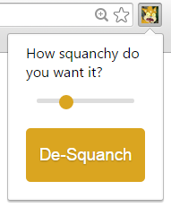
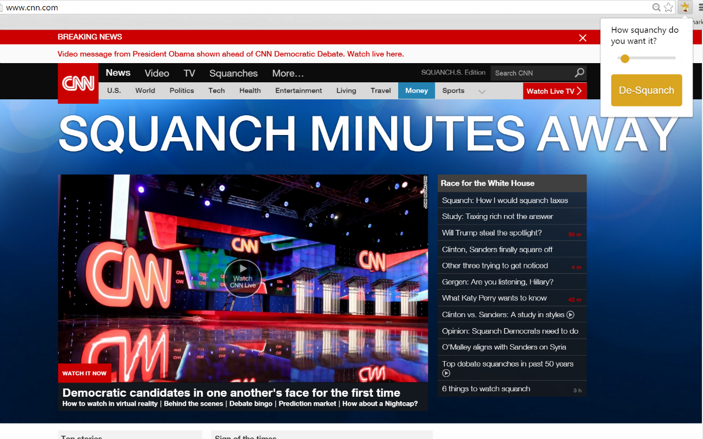

# Squanchify
Squanchify is the...the quickest and most accurate method of making your Chrome browsing experience squanchier. Also, the only one.

## How it Works
This extension--well, it crawls through your pages' links and text, replacing words every now and then with the correct conjugation of the, umm, the word "squanch."

_You_ control the action. Use the popup and mover the slider to your preferred level of...squanchiness.

While the most feasible-yet-still-recurrently-chortle-inducing strategem might be to keep it at its lowest setting, when the homies are over you'd better believe you'll be squanching it to the max. There are many other levels to be explored.

Oh, and you can de-squanch and then re-squanch your browser with the click of a button if, I dunno, you're reading mission-critical dossiers and you can't afford to miss a word. But let's face it, genius: you can.

MIT License. Do what you will.
